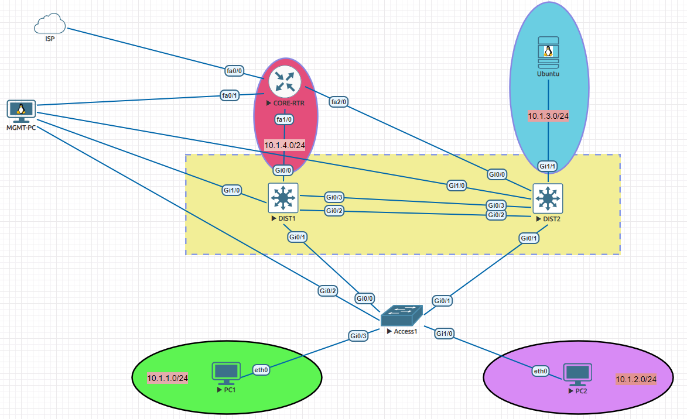

# cisco-campus-lab

## Description
This project provides a lab environment for configuring Cisco campus network devices, focusing on automation. It includes configuration files for various network layers and a Python script to apply these configurations, facilitating a hands-on learning and testing experience for network engineers.

## Features/Components
*   **Configuration Files:** Pre-defined configurations for Access, Core, and Distribution layer switches.
    *   `cisco_config/access.txt`
    *   `cisco_config/core.txt`
    *   `cisco_config/dist1.txt`
    *   `cisco_config/dist2.txt`
    *   `cisco_config/base_config.txt`
*   **Configuration Automation Script:** A Python script (`config_device.py`) to push configurations to network devices.
*   **EVE-NG Lab Integration:** An EVE-NG lab topology image (`cisco_config/eve-lab.png`) to visualize the network setup.
    
*   **YAML Configuration:** YAML files (`access_layer_devices.yaml`, `core_layer_devices.yaml`, `distribution_layer_1_devices.yaml`, `distribution_layer_2_devices.yaml`) for defining device parameters and configurations.

## Setup/Usage
1.  **Prerequisites:**
    *   Python 3.x
    *   `netmiko` library (install via `pip install netmiko`)
    *   Access to Cisco network devices (physical or virtual, e.g., in EVE-NG).
2.  **Clone the Repository:**
    ```bash
    git clone https://github.com/sydasif/cisco-campus-lab.git
    cd cisco-campus-lab
    ```
3.  **Configure Devices:**
    *   Edit the YAML files (`access_layer_devices.yaml`, `core_layer_devices.yaml`, `distribution_layer_1_devices.yaml`, `distribution_layer_2_devices.yaml`) to match your device credentials and IP addresses.
    *   Run the `config_device.py` script to apply configurations:
        ```bash
        python config_device.py
        ```
    *   Follow the prompts to select the device type and apply the desired configuration.

## File Structure
*   `.gitignore`: Specifies intentionally untracked files to ignore.
*   `access_layer_devices.yaml`: YAML configuration for access layer devices.
*   `config_device.py`: Python script for automating device configuration.
*   `core_layer_devices.yaml`: YAML configuration for core layer devices.
*   `distribution_layer_1_devices.yaml`: YAML configuration for distribution layer 1 devices.
*   `distribution_layer_2_devices.yaml`: YAML configuration for distribution layer 2 devices.
*   `LICENSE`: Project license file.
*   `README.md`: This README file.
*   `cisco_config/`: Directory containing raw configuration files and lab images.
    *   `cisco_config/access.txt`: Access layer device configuration.
    *   `cisco_config/base_config.txt`: Base configuration for devices.
    *   `cisco_config/config.cfg`: Generic configuration file (can be used as a template).
    *   `cisco_config/core.txt`: Core layer device configuration.
    *   `cisco_config/dist1.txt`: Distribution layer 1 device configuration.
    *   `cisco_config/dist2.txt`: Distribution layer 2 device configuration.
    *   `cisco_config/eve-lab.png`: EVE-NG lab topology image.
